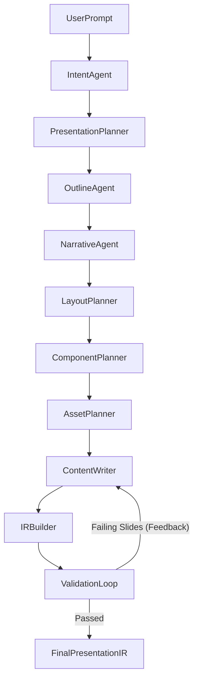

# Orivox V3 - AI Generation Pipeline Architecture

This document defines the intelligence architecture for Orivox V3. It transforms a user's natural language prompt into a highly structured, strict `PresentationIR` payload. 

Orivox uses a multi-agent orchestrated pipeline. A monolithic LLM prompt is strictly prohibited. Each agent has exactly one atomic responsibility, consumes structured inputs from preceding agents, and produces structured outputs.

---

## 1. PIPELINE EXECUTION FLOW

The generation sequence executes deterministically:

*Note: In the future, once the `AssetPlanner` completes, the `ContentWriter` can be parallelized, instantiating one writer agent per slide concurrently.*

---

## 2. AGENT SPECIFICATIONS

### 1. Intent Agent
- **Purpose**: Extract high-level constraints from raw user language.
- **Inputs**: Raw User Prompt (String).
- **Outputs**: `IntentConfig` (JSON: Audience, tone, presentation type, estimated length, educational depth).
- **Prompt Contract**: "You are an intent parser. Read the prompt and map it strictly to the Orivox IntentConfig JSON schema."
- **Dependencies**: None.
- **Failure Conditions**: Prompt is too short/vague.
- **Regeneration Strategy**: Apply default fallback (e.g., General Audience, 10 slides, informative tone) and proceed.

### 2. Presentation Planner
- **Purpose**: Determine macro-level structural rhythms.
- **Inputs**: `IntentConfig`.
- **Outputs**: `PresentationStructure` (JSON: section count, pacing rhythm, information density score, narrative style).
- **Dependencies**: Intent Agent.

### 3. Outline Agent
- **Purpose**: Generate the logical sequence of topics.
- **Inputs**: `PresentationStructure`.
- **Outputs**: `OutlinePlan` (JSON: Array of Sections, each with an Array of Slide Topics).
- **Dependencies**: Presentation Planner.

### 4. Narrative Agent
- **Purpose**: Assign a strict storytelling role to every slide in the outline.
- **Inputs**: `OutlinePlan`.
- **Outputs**: `NarrativePlan` (JSON: `OutlinePlan` appended with `slide_purpose` [Opening, Context, Explanation, Comparison, Transition, CTA]).
- **Prompt Contract**: "Assign exactly one narrative role to each slide topic to create a cinematic flow."

### 5. Layout Planner
- **Purpose**: Select structural foundations from the Layout Registry.
- **Inputs**: `NarrativePlan`, `LayoutRegistry` metadata.
- **Outputs**: `LayoutPlan` (JSON: mapping every slide to a registered `layout_id`).
- **Prompt Contract**: "Select a layout ID for each slide. You must optimize visual rhythm (no repeated layouts > 2 times) and balance text/visuals based on the slide's narrative purpose."
- **Dependencies**: Narrative Agent, Layout Registry.

### 6. Component Planner
- **Purpose**: Select specific data wrappers from the Component Registry.
- **Inputs**: `LayoutPlan`, `ComponentRegistry` metadata.
- **Outputs**: `ComponentPlan` (JSON: mapping every slide to an array of valid `component_types`).
- **Prompt Contract**: "Select components for the selected layout. You must strictly obey the layout's `supported_components` constraint."
- **Failure Conditions**: Hallucinates a component type not in the registry, or exceeds layout limits.

### 7. Asset Planner
- **Purpose**: Determine visual asset requirements.
- **Inputs**: `ComponentPlan`.
- **Outputs**: `AssetPlan` (JSON: specifications for required images, charts, and diagrams). 
- **Notes**: Does *not* generate the image or mermaid string. It simply dictates: "Slide 3 requires an architecture diagram."

### 8. Content Writer
- **Purpose**: Populate the semantic content inside the chosen components.
- **Inputs**: `AssetPlan`, `IntentConfig`.
- **Outputs**: `SlideContent` (JSON payloads mapping precisely to the `ComponentRegistry` payload schema for that specific slide).
- **Prompt Contract**: "You are a copywriter. Write the raw text, charts, and diagrams for this slide based on the predefined layout and components. Obey max word counts."
- **Dependencies**: ALL previous agents. This is the heavy lifter.
- **Failure Conditions**: Writes 60 words for a component constrained to 20 words.
- **Regeneration Strategy**: Receives targeted error strings from the Validation Loop and rewrites just that component.

### 9. Presentation IR Builder
- **Purpose**: Synthesize all agent outputs into the canonical `PresentationIR`.
- **Inputs**: All previously generated plans.
- **Outputs**: A raw `PresentationIR` object.
- **Execution**: This is a deterministic mapping function (pure code, not an LLM).

### 10. Validation Loop
- **Purpose**: Enforce quality gates.
- **Inputs**: `PresentationIR`.
- **Outputs**: A finalized `PresentationIR`, or a feedback loop back to the Content Writer.
- **Execution Flow**:
  1. Executes `ValidationEngine.validate(ir)`.
  2. If `should_regenerate` is true: Isolates the specific slides that threw errors (e.g., "Slide 4 Chart data malformed").
  3. Sends *only* the failing slide's JSON and the error message back to the `ContentWriter` with the prompt: "Your previous output failed validation: [Error Message]. Fix the JSON."
  4. Preserves passing slides (saving massive token costs).
  5. Repeats until `should_regenerate` is false, or max retries (3) is hit.
